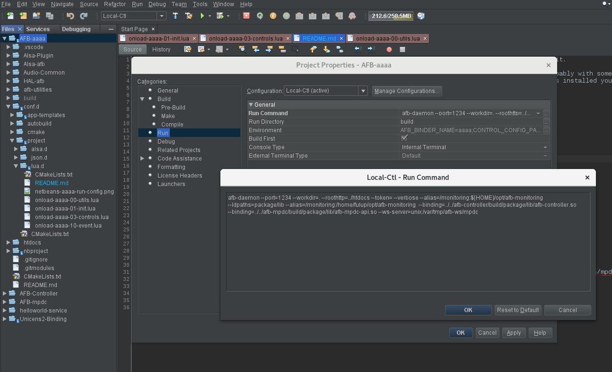

WARNING: controller is now independent from AAAA and thus should be imported by your binder before requesting it.

For this your only have to provide the path where to find your controller you are in your development tree probably with something
like --binding=../../afb-controller/build/ctl-binding/afb-controller.so on the other hand if you controller was installed you
should import it from where ever you install it.

To run this controller sample from your developpement environement use
```

export BUILD_DIR=build

# with an internal MPDC (Pusic Player Daemon Client) API
afb-daemon --port=1234 --workdir=. --roothttp=../htdocs --token= --verbose \
--alias=/monitoring:$HOME/opt/afb-monitoring  \
--ldpaths=package/lib  \
--alias=/monitoring:/home/fulup/opt/afb-monitoring  \
--binding=../../afb-controller/$BUILD_DIR/package/lib/afb-controller.so  \
--binding=../../afb-mpdc/$BUILD_DIR/package/lib/afb-mpdc-api.so  \
--ws-server=unix:/var/tmp/afb-ws/mpdc

# with an exernal MPDC API
afb-daemon --port=1234 --workdir=. --roothttp=../htdocs --token= --verbose \
--alias=/monitoring:$HOME/opt/afb-monitoring  \
--ldpaths=.  \
--alias=/monitoring:/home/fulup/opt/afb-monitoring  \
--binding=../../afb-controller/$BUILD_DIR/ctl-binding/afb-controller.so  \
--ws-client=unix:/var/tmp/afb-ws/mpdc

# Note: 
  - Both sample make the assumption the monitoring HTML5 app is avaliable at $HOME/opt/afb-monitoring
  - With second sample you should obviously have your MPDC service exposing its API with --ws-server=unix:/var/tmp/afb-ws/mpdc
  - Should use 'make populate' to get ./build/package/lib to be uptodate

```

Running AAAA from you IDE 
